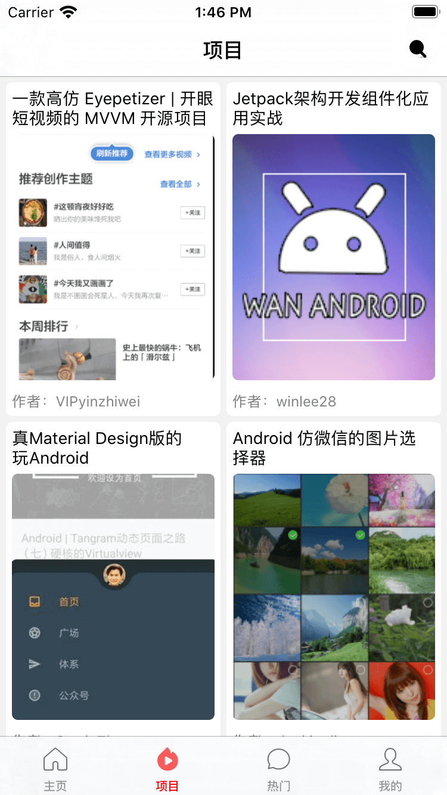

# Swift5+MVC+WanAndroid项目(纯代码)

## 前言
 最近学习了swift5,使用[WanAndroid开放API](http://www.wanandroid.com/) 制作了一个简易APP练手,实现了一些常用的功能(新手练习还是不错的),UI页面制作的不是很精美,还请见谅!
 
 ## 项目截图
 | ||
 
 ## 主要功能

- 首页、项目、热门、我的四大模块；
- 登录注册功能；
- 搜索功能：热门搜索、搜索历史；
- 文章列表,网格布局；
- Tab切换功能
- 自动轮播图
- 自定义的上/下拉刷新
- Toast提醒
- 网络请求封装
- 常用view扩展

## 主要开源框架

  - pod 'Moya'//网络二次封装
  - pod 'PrintBeautifulLog'
  - pod 'Alamofire'  #网络, '~> 4.7'
  - pod 'MJRefresh' #刷新
  - pod 'LLCycleScrollView' #轮播
  - pod 'EmptyDataSet-Swift'
  - pod 'MBProgressHUD'
  - pod 'HandyJSON'
  - pod 'Kingfisher' #图片
  - pod 'Then' #语法糖
  - pod 'SnapKit', '~> 4.2.0'
  - pod 'SnapKitExtend' #自动布局扩展
  - pod 'SVProgressHUD'
  - pod 'MBProgressHUD'
  - pod 'Reusable'  #可复用
  - pod 'Tabman' #tab导航
  - pod 'JXSegmentedView'
  - pod 'Toast-Swift’, '~> 5.0.1'
